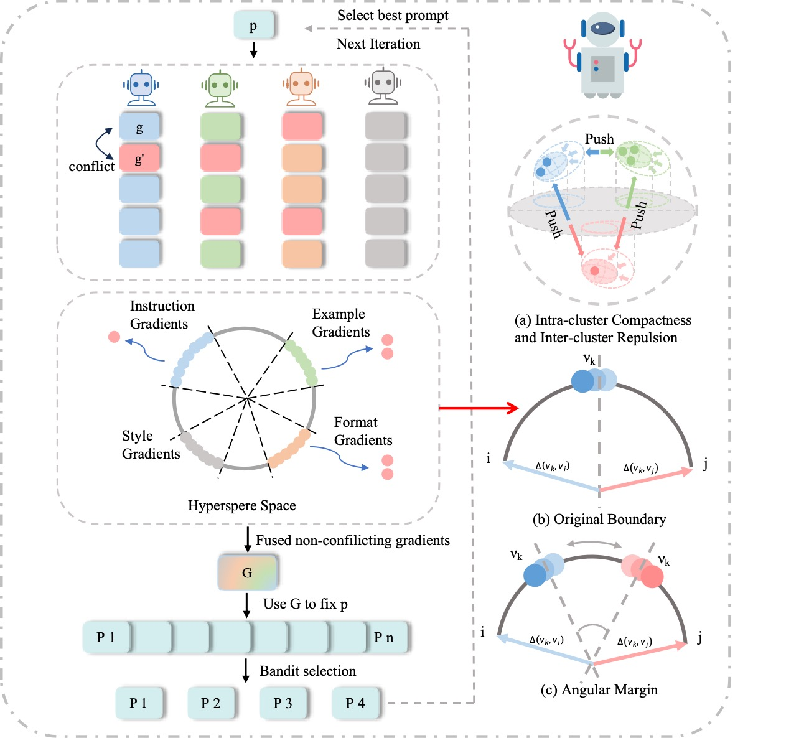

<div align="center">

<h1> MAPGD: Multi-Agent Prompt Gradient Descent for Collaborative Prompt Optimization </h1>

<h4 align="center"> 

Yichen Han<sup>1,*</sup>,
Yuhang Han<sup>2,*</sup>,
Bojun Liu<sup>3</sup>,
Zhengpeng Zhou<sup>4</sup>,
Guanyu Liu<sup>5</sup>,
Zeng Zhang<sup>1</sup>,
Yang Yang<sup>6</sup>,
Wenli Wang<sup>6</sup>,
Isaac N Shi<sup>6</sup>,
Yunyan Zhang<sup>6</sup>,
Lewei He<sup>1✉</sup>,
Tianyu Shi<sup>7✉</sup>

<sup>1</sup>South China Normal University
<sup>2</sup>Shanghai Jiao Tong University
<sup>3</sup>University of Sydney
<sup>4</sup>Shanghai Jiaotong University
<sup>5</sup>University of Macau
<sup>6</sup>Silicon Sapiens LLC
<sup>7</sup>University of Toronto

<p>
<a href='https://arxiv.org/pdf/2509.11361'></a>
</p>

</h4>
</div>
<p align='center'>

</p>

## 🚀 Abstract
Prompt design critically affects the performance of large language models (LLMs). Existing optimization methods often rely on single-agent heuristics, which lack diversity, collaboration, and robustness.  
**MAPGD** introduces a multi-agent framework where each agent explores prompts from different perspectives, generates textual “gradients,” and collaboratively improves prompts via **beam search**, **semantic fusion**, and **bandit-based selection**.  
This approach improves diversity, semantic directionality, and interpretability—offering a scalable and effective solution for real-world prompt engineering.
## 🧩 Core Features

- **Multi-Agent Exploration:** Agents specialize in instruction clarity, example selection, output format, style, or mathematical reasoning.  
- **Textual Gradients:** Agents generate natural language pseudo-gradients akin to numerical gradients.  
- **Gradient Coordination:** HCGC ensures intra-cluster compactness and inter-cluster separation of gradients.  
- **Adaptive Weighting:** CAAW dynamically adjusts agent contributions based on historical performance.  
- **Beam Search & Bandit Selection:** Efficiently expand candidate prompts and select the best ones.  

## ⚙️ System Workflow

```text
Input: Initial prompt p0, datasets D_train / D_dev

Iterative Optimization:
  1. Agents generate specialized textual gradients
  2. HCGC clusters and fuses gradients
  3. Prompt expander generates candidate prompts (beam + paraphrasing)
  4. CAAW bandit-based selection chooses top candidates
  5. Agents synchronize with best candidate

Output: Optimized prompt
```
## 🚀 How to Start
### 1. Clone the repository
```bash
git clone https://github.com/kawhiiiileo/MAPGD.git
cd MAPGD
```
### 2. Run experiments with a specific task

To choose different task sets, use the --task argument.
For example:
```
python experiment_baseline.py --task echo
python experiment_baseline.py --task aqua
```
Detailed settings can be customized in the configuration files:

Config files are located in the root folder for each task, e.g., echo_config.py, aqua_config.py.

You can customize hyperparameters such as beam_size, max_iterations, or CAAW lambda directly in the config.

## 📊 Dataset

### 1. ECHO Dataset
| Task          | Dataset Description                                                                                   | Reference                                                                                                                                                                                                         |
| ------------- | ----------------------------------------------------------------------------------------------------- | ----------------------------------------------------------------------------------------------------------------------------------------------------------------------------------------------------------------- |
| **ECHO**      | English online hate speech detection dataset, containing 997 annotated online comments.               | Ioannis Mollas, Zoe Chrysopoulou, Stamatis Karlos, and Grigorios Tsoumakas. *Ethos: An online hate speech detection dataset.* arXiv preprint arXiv:2006.08328, 2020.                                              |
| **AQUA**      | Algebraic word problems for program induction and step-by-step reasoning.                             | Wang Ling, Dani Yogatama, Chris Dyer, and Phil Blunsom. *Program induction by rationale generation: Learning to solve and explain algebraic word problems.* arXiv preprint arXiv:1705.04146, 2017.                |
| **GSM8k**     | Grade-school math problems requiring multi-step reasoning, widely used benchmark.                     | Cobbe, Karl et al. *Training verifiers to solve math word problems.* arXiv preprint arXiv:2110.14168, 2021.                                                                                                       |
| **SVAMP**     | Simple arithmetic word problems with linguistic variations, testing robustness to paraphrasing.       | Patel, Ananya et al. *SVAMP: A benchmark for arithmetic word problem solving.* arXiv preprint arXiv:2011.06770, 2020.                                                                                             |
| **LIAR**      | Short statements labeled with ground-truth veracity, used for fake news detection.                    | William Y. Wang. *“Liar, Liar Pants on Fire”: A new benchmark dataset for fake news detection.* ACL, 2017.                                                                                                        |
| **Jailbreak** | Multilingual prompts targeting jailbreak detection for LLMs, containing 1,306 examples.               | Xinyue Shen, Zeyuan Chen, Michael Backes, Yun Shen, and Yang Zhang. *“Do Anything Now”: Characterizing and evaluating in-the-wild jailbreak prompts on large language models.* Proc. of ACM CCS, 2024, 1671–1685. |
| **Ethos**     | English hate speech detection dataset, used for benchmarking multi-agent prompt optimization.         | Vidgen, Bertie et al. *Learning to detect harmful online content.* arXiv preprint arXiv:2004.08617, 2020.                                                                                                         |
| **Sarcasm**   | Arabic sarcasm detection dataset with 10,000 online comments labeled for presence/absence of sarcasm. | Ibrahim Abu Farha and Walid Magdy. *From Arabic sentiment analysis to sarcasm detection: The ArSarcasm dataset.* The 4th Workshop on Open-Source Arabic Corpora and Processing Tools, ELRA, 2020, 32–39.          |

## 🔧 Notes

MAPGD supports both text classification and mathematical reasoning tasks.

Multi-agent collaboration is enabled by default, and HCGC+CAAW fusion ensures semantic consistency and adaptive weighting.

The framework allows easy integration of new agents or tasks by extending SpecializedPromptAgent and updating TASK_AGENT_MAPPING.

## 📖 Citation

If you find our work useful, please consider citing:

```bibtex
@misc{han2025mapgdmultiagentpromptgradient,
      title={MAPGD: Multi-Agent Prompt Gradient Descent for Collaborative Prompt Optimization}, 
      author={Yichen Han and Yuhang Han and Bojun Liu and Zhengpeng Zhou and Guanyu Liu and Zeng Zhang and Yang Yang and Wenli Wang and Isaac N Shi and Yunyan Zhang and Lewei He and Tianyu Shi},
      year={2025},
      eprint={2509.11361},
      archivePrefix={arXiv},
      primaryClass={cs.AI},
      url={https://arxiv.org/abs/2509.11361}, 
}


